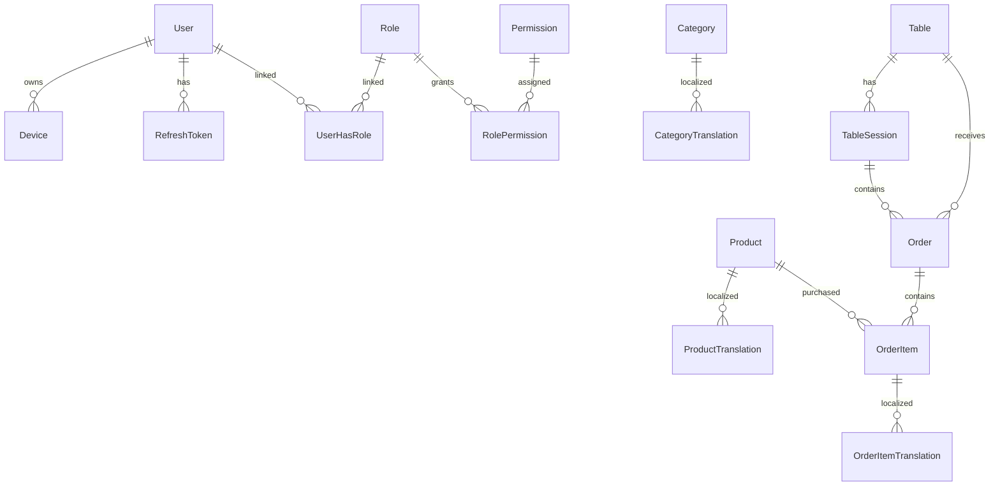

# Database Documentation

## Overview

- **Database**: PostgreSQL
- **ORM**: Prisma ORM
- **Backend**: NestJS
- **Architecture**: Modular Feature-Based Architecture
- **Main Domain**: Restaurant / Food Management System

### Naming Conventions

| Element | Convention | Example |
|---|---|---|
| Tables | PascalCase (Prisma Model) | `User`, `OrderItem` |
| Database Tables | snake_case (generated) | `order_items` |
| Columns | camelCase | `createdAt`, `userId` |
| Foreign Keys | `[entity]Id` | `productId`, `tableId` |
| Indexes | Composite query-based | `@@index([tableId, endedAt])` |

---

# Entities by Feature

---

# Authentication Feature

## users

| Column | Type | Constraints |
|---|---|---|
| id | Int | PK, AUTO_INCREMENT |
| email | String | UNIQUE, NOT NULL |
| password | String | NOT NULL |
| name | String | NOT NULL |
| phoneNumber | String | NULLABLE |
| avatar | String | NULLABLE |
| totpSecret | String | UNIQUE, NULLABLE |
| status | UserStatus | DEFAULT INACTIVE |
| passwordVersions | Int | DEFAULT 0 |
| createdAt | DateTime | AUTO |
| updatedAt | DateTime | AUTO |
| deletedAt | DateTime | Soft delete |

### Notes

- `passwordVersions` dùng để invalidate JWT/refresh token toàn hệ thống.
- `totpSecret` hỗ trợ 2FA.
- Không bao giờ return password ra API response.

---

## devices

| Column | Type | Constraints |
|---|---|---|
| id | Int | PK |
| userId | Int | FK → users |
| userAgent | String | NOT NULL |
| ip | String | NOT NULL |
| isActive | Boolean | DEFAULT TRUE |
| lastActive | DateTime | AUTO |
| createdAt | DateTime | AUTO |

### Notes

- Hỗ trợ multi-device login.
- Dùng để revoke session theo device.
- High-write table → tránh eager loading nặng.

---

## refresh_tokens

| Column | Type | Constraints |
|---|---|---|
| token | String | UNIQUE |
| userId | Int | FK → users |
| deviceId | Int | FK → devices |
| expiresAt | DateTime | INDEXED |
| createdAt | DateTime | AUTO |

### Notes

- Token lưu raw string → production nên hash token trước khi lưu DB.
- Cleanup bằng cron job theo `expiresAt`.

---

## verification_codes

| Column | Type | Constraints |
|---|---|---|
| id | Int | PK |
| email | String | UNIQUE |
| code | String | NOT NULL |
| type | RegistrationCodeType | ENUM |
| expiresAt | DateTime | INDEXED |
| createdAt | DateTime | AUTO |

### Use Cases

| Action | Implementation |
|---|---|
| Register | Send OTP |
| Forgot Password | Verify email ownership |
| Expiration Cleanup | Delete expired records |

---

# RBAC Feature

## roles

| Column | Type | Constraints |
|---|---|---|
| id | Int | PK |
| name | String | UNIQUE |
| description | String | NOT NULL |
| isActive | Boolean | DEFAULT TRUE |
| isSystem | Boolean | DEFAULT FALSE |
| createdAt | DateTime | AUTO |
| updatedAt | DateTime | AUTO |
| deletedAt | DateTime | Soft delete |

---

## permissions

| Column | Type | Constraints |
|---|---|---|
| id | Int | PK |
| name | String | NOT NULL |
| path | String | NOT NULL |
| method | HTTPMethod | ENUM |
| module | String | DEFAULT Unknown |
| description | String | DEFAULT "" |

### Important

```text
(method + path) MUST be unique
```

### Existing Optimization

```prisma
@@unique([method, path])
@@index([method, path, module])
```

---

## user_has_role

| Column | Type | Constraints |
|---|---|---|
| userId | Int | FK → users |
| roleId | Int | FK → roles |

### Notes

- Many-to-many pivot table.
- Composite primary key.

---

## role_permissions

| Column | Type | Constraints |
|---|---|---|
| roleId | Int | FK → roles |
| permissionId | Int | FK → permissions |

---

# Product Catalog Feature

## categories

| Column | Type | Constraints |
|---|---|---|
| id | Int | PK |
| userId | Int | FK → users |
| createdAt | DateTime | AUTO |
| updatedAt | DateTime | AUTO |
| deletedAt | DateTime | Soft delete |

### Notes

- Category text không lưu trực tiếp.
- Localization nằm ở `category_translations`.

---

## category_translations

| Column | Type | Constraints |
|---|---|---|
| id | Int | PK |
| categoryId | Int | FK → categories |
| languageId | Int | FK → languages |
| name | String | NOT NULL |
| description | String | NOT NULL |

### Existing Optimization

```prisma
@@unique([categoryId, languageId])
```

---

## products

| Column | Type | Constraints |
|---|---|---|
| id | Int | PK |
| ownerId | Int | FK → users |
| basePrice | Float | NOT NULL |
| virtualPrice | Float | NOT NULL |
| createdAt | DateTime | AUTO |
| updatedAt | DateTime | AUTO |
| deletedAt | DateTime | Soft delete |

### Notes

⚠️ Current limitation:

```text
Float should be migrated to Decimal for money precision.
```

Recommended:

```prisma
Decimal @db.Decimal(15,2)
```

---

## product_translations

| Column | Type | Constraints |
|---|---|---|
| id | Int | PK |
| productId | Int | FK → products |
| languageId | Int | FK → languages |
| name | String | NOT NULL |
| description | String | NOT NULL |
| cookingInstructions | String | DEFAULT "" |

### Notes

- Snapshot localized content.
- Used for multilingual UI.

---

## image_products

| Column | Type | Constraints |
|---|---|---|
| id | Int | PK |
| productId | Int | FK → products |
| url | String | NOT NULL |
| status | ImageStatus | DEFAULT TEMP |
| deletedAt | DateTime | Soft delete |

### Image Lifecycle

| Status | Meaning |
|---|---|
| TEMP | Uploaded but unused |
| ACTIVE | Attached to product |
| DELETED | Soft deleted |

---

# Restaurant Feature

## tables

| Column | Type | Constraints |
|---|---|---|
| id | Int | PK |
| name | String | UNIQUE |
| capacity | Int | NOT NULL |
| status | TableStatus | DEFAULT EMPTY |
| isActive | Boolean | DEFAULT TRUE |

### Notes

⚠️ `status` không phải source of truth tuyệt đối.

Real state nên kiểm tra:

```text
active table session
```

---

## table_qr_codes

| Column | Type | Constraints |
|---|---|---|
| id | Int | PK |
| tableId | Int | UNIQUE, FK → tables |
| token | String | UNIQUE |
| expiredAt | DateTime | NULLABLE |

### Notes

- Guest ordering bằng QR token.
- Token phải random + rotateable.

---

## table_sessions

| Column | Type | Constraints |
|---|---|---|
| id | Int | PK |
| tableId | Int | FK → tables |
| token | String | UNIQUE |
| startedAt | DateTime | AUTO |
| endedAt | DateTime | NULLABLE |

### Existing Optimization

```prisma
@@index([tableId, endedAt])
```

### Session Flow

```text
Customer sits
→ create session
→ order food
→ payment
→ end session
```

---

# Order Feature

## orders

| Column | Type | Constraints |
|---|---|---|
| id | Int | PK |
| tableId | Int | FK → tables |
| tableSessionId | Int | FK → table_sessions |
| userId | Int | FK → users, NULLABLE |
| guestName | String | NULLABLE |
| source | OrderSource | ENUM |
| status | OrderStatus | DEFAULT PENDING |
| total | Float | DEFAULT 0 |
| createdAt | DateTime | AUTO |
| updatedAt | DateTime | AUTO |

### Order Sources

| Source | Meaning |
|---|---|
| GUEST_QR | Guest scan QR |
| USER_REMOTE | Logged-in remote order |

---

## order_items

| Column | Type | Constraints |
|---|---|---|
| id | Int | PK |
| orderId | Int | FK → orders |
| productId | Int | FK → products |
| quantity | Int | NOT NULL |
| price | Float | Snapshot price |
| createdAt | DateTime | AUTO |

### Important

⚠️ `price` là snapshot value.

Không bao giờ sync lại theo giá product hiện tại.

---

## order_item_translations

| Column | Type | Constraints |
|---|---|---|
| id | Int | PK |
| orderItemId | Int | FK → order_items |
| languageId | Int | FK → languages |
| name | String | Snapshot |
| description | String | Snapshot |
| cookingInstructions | String | Snapshot |

### Notes

Preserve lịch sử multilingual tại thời điểm order.

---

# Messaging Feature

## messages

| Column | Type | Constraints |
|---|---|---|
| id | Int | PK |
| fromUserId | Int | FK → users |
| toUserId | Int | FK → users |
| content | String | NOT NULL |
| readAt | DateTime | NULLABLE |
| createdAt | DateTime | AUTO |

### Notes

High-growth table.

Future scaling recommendation:

```text
Partition by createdAt
```

---

# Payment Feature

## payment_transactions

| Column | Type | Constraints |
|---|---|---|
| id | Int | PK |
| gateway | String | NOT NULL |
| accountNumber | String | NOT NULL |
| amountIn | Int | DEFAULT 0 |
| amountOut | Int | DEFAULT 0 |
| accumulated | Int | DEFAULT 0 |
| transactionContent | String | NULLABLE |
| referenceNumber | String | NULLABLE |
| body | String | NULLABLE |
| transactionDate | DateTime | AUTO |

### Notes

- Append-only transaction log.
- Không nên SELECT `body` ở list APIs.

---

# ERD Diagram



---

# Key Relationships

| Relationship | Type | Notes |
|---|---|---|
| users → devices | 1:N | Multi-device login |
| users → refresh_tokens | 1:N | Session persistence |
| users ↔ roles | N:N | RBAC |
| roles ↔ permissions | N:N | Authorization |
| tables → table_sessions | 1:N | Dining lifecycle |
| orders → order_items | 1:N | Snapshot transaction |
| products → translations | 1:N | Multilingual |

---

# Conventions

| Convention | Implementation |
|---|---|
| Soft Delete | `deletedAt` |
| Timestamps | `createdAt`, `updatedAt` |
| Many-to-many | Pivot table |
| Translation | Separate translation tables |
| Money | Float (should migrate to Decimal) |
| Auth | Device-based refresh token |

---

# Indexes

```prisma
@@index([deletedAt])

@@index([expiresAt])

@@index([tableId, endedAt])

@@index([method, path, module])

@@unique([method, path])

@@unique([productId, languageId])

@@unique([categoryId, languageId])
```

---

# Transaction Rules

## MUST use transactions

### Order Creation

```text
create order
→ create items
→ calculate total
→ commit
```

### OTP Verification

```text
verify code
→ activate user
→ delete code
```

### RBAC Update

```text
update role
→ update permissions
→ invalidate cache
```

---

# Redis Cache Strategy

| Cache Key | TTL |
|---|---|
| permissions:userId | 15m |
| product:list | 5m |
| categories | 30m |
| languages | 1h |

---

# Performance Notes

## Avoid

```sql
OFFSET 100000
```

Use:

```sql
WHERE id > ?
LIMIT 20
```

(cursor pagination)

---

## Prevent N+1 Queries

Bad:

```text
products → translations loop query
```

Good:

```ts
include: {
  ProductTranslation: true
}
```

---

# Best Practices

- Never hard delete production data
- Never expose password field
- Always filter `deletedAt IS NULL`
- Use transactions for critical writes
- Snapshot order price/history
- Cache RBAC permissions in Redis
- Avoid eager loading large relations
- Use OpenTelemetry tracing for DB bottlenecks

---